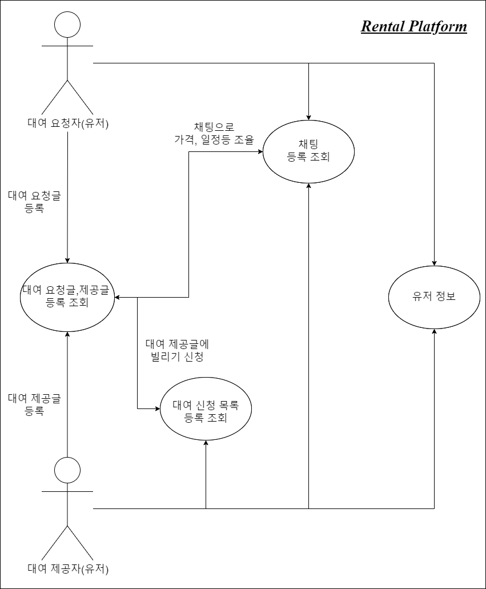
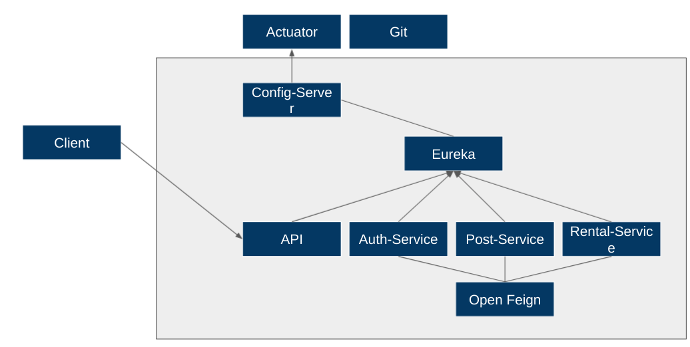
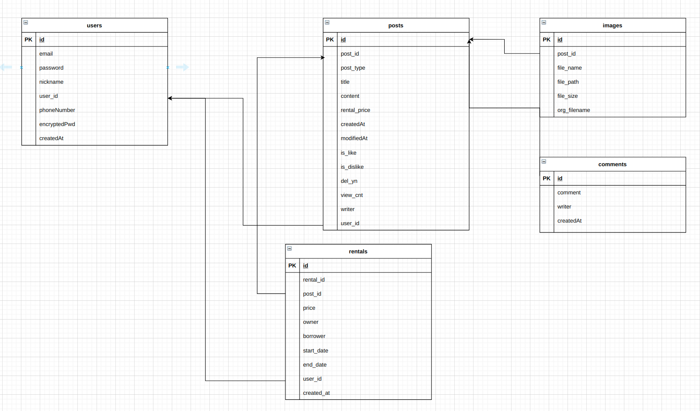

## 프로젝트 설명
• 개요
유저 간 빌려주고 싶은 혹은 빌리고 싶은 물건들을 게시글을 바탕으로 대여를 할수있는 기능을 가진 애플리케이션입니다.

• 내용
유저는 빌리는사람과 빌려주는 사람 2가지 타입으로 서비스를 이용할 수 있습니다.
또한 채팅이나 댓글을 통해 가격이나 날짜등의 세부사항을 조절할수 있습니다.
조건이 맞을경우에 빌리기버튼를 통해서 빌리기 신청을 할수있으며 빌려주는 사람은 해당 요청을 수락할수도있고 거절할수도 있습니다.

• 진행 과정
Spring Cloud Gateway
Spring Cloud Gateway는 하나의 api gateway server를 만들어 클라이언트의 요청을 해당 게이트웨이 서버로 보내고 조건에 따라 이 요청에 해당하는 서비스에 요청을 전달해주는 역할을 합니다.
만약 Spring Cloud Gateway를 사용하지않는다면 포트가 바뀐다면 포트가 바뀐 서버를 제외한 모든 서버는 바뀐 포트의 번호를 수정하고 다시 빌드 -> 배포를 해야하는 상황이다.

하지만 Spring Cloud Gateway를 통해서 모든 마이크로서비스 포트를 단일화할수있고 어떤 마이크로서비스를 호출할 때도 포트를 신경쓰지 않아도 된다.

Spring Cloud Config
Spring Cloud Config는 서버, 클라이언트 구성에 필요한 설정 정보 (application.yml)를 외부 시스템에서 관리합니다. 외부 시스템 즉, 하나의 중앙화된 저장소에서 설정 정보를 관리 가능하며 배포 파이프라인을 통해 dev, uat, prod 환경에 맞는 구성 정보를 사용합니다.

Spring Cloud Config를 통해서 분산된 환경에서 설정 파일을 외부로 분리할 수 있도록 해준다. 개발/테스트 환경 그리고 운영 환경에서까지 모든 환경 구성을 간편하게 관리할 수 있다. 설정을 위한 별도의 서버를 구성하기 때문에 실행 중인 애플리케이션이 서버에서 설정 정보를 받아와 갱신하는 방식이다. 즉 실행 중에 설정값 변경이 필요해지면, 설정 서버만 변경하고 애플리케이션은 갱신하도록 해주기만 하면 된다. 따라서 설정이 바뀔 때마다 빌드와 배포가 필요 없는 구조이다.

Kafka
카프카는 메세지큐이다. 메세지큐의 목적은 단순하다. 메세지를 한곳에 던지고 그걸 필요한 주체가 가져다 처리한다. 이건 RabbitMQ, 카프카, 멤캐시 등 다수의 제품들의 기본기능이다.  일단 메세지큐를 가장 많이쓰는 서비스는 로그 관리이다. 어느 회사들 로그관리의 필요성을 가지게 되고 그에 맞는 로그 시스템을 구축한다. 
현재 내가 재직중인 회사에선 로그를 모아서 AI 및 각종 통계를 내는거에 목적을 가지고있다. 

Kafka는 복잡한 라우팅에 의존하지 않고 최대 처리량으로 스트리밍하는 데 가장 적합합니다. 또한 이벤트 소싱, 스트림 처리 및 일련의 이벤트로 시스템에 대한 모델링 변경을 수행하는 데 이상적입니다. Kafka는 다단계 파이프라인에서 데이터를 처리하는 데도 적합합니다.

• 개선점
독립적으로 배포 가능하고 개발자의 자율성 증가, 장애나는 서비스 격리를 통한 서버 재기동 시간 단축, 팀별 코드 이해도 증가 및 유지보수 난이도 저하

---
## 기술스택
- OS: Windows
- Frontend: React
- Backend: Java, SpringBoot, JPA, SpringCloud(Gateway, Eureka, Config, Kafka)
- DB: MariaDB
- VCS: Git
- IDE: IntelliJ, VSC

---
## 유즈케이스(UseCase Diagram)

---
## 프로젝트 구조

---
## 데이터베이스 구조

